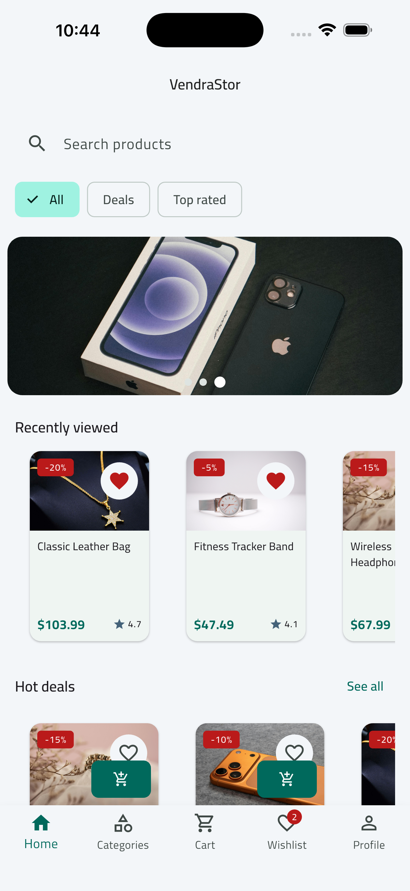
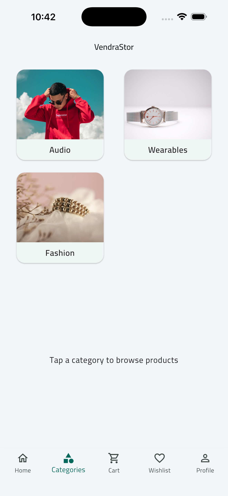
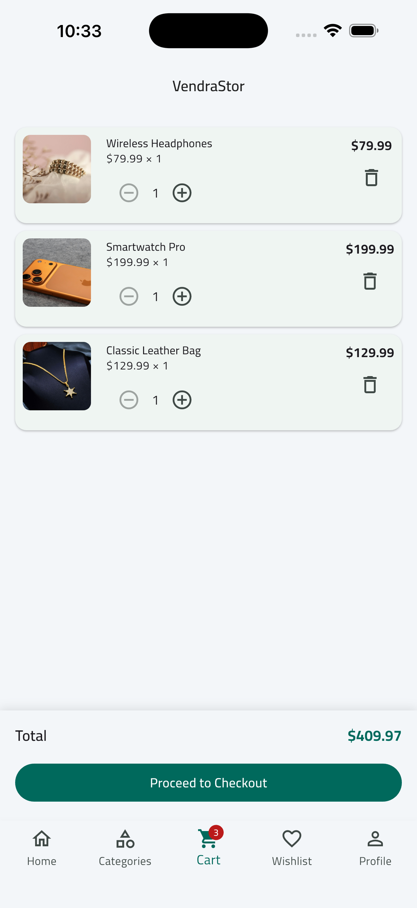
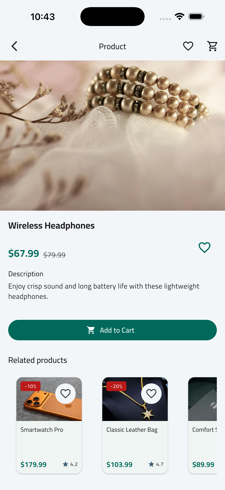
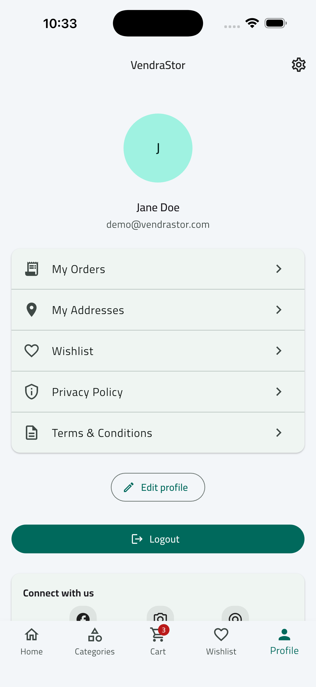
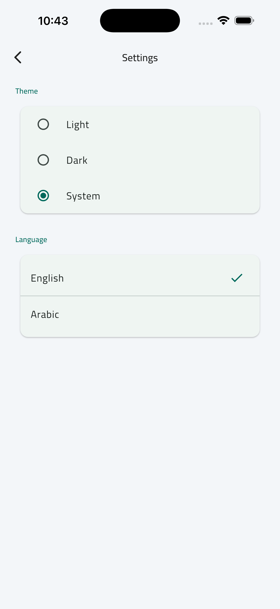

# VendraStor

A modern Flutter e-commerce application built with Clean Architecture, Bloc/Cubit state management, and scalable feature-based modules.

VendraStor demonstrates production-ready app structure and engineering practices for shopping workflows such as authentication, product browsing, cart/wishlist management, checkout, orders, profile, addresses, localization, and app settings.

## Features

- Authentication (login, register, forgot password)
- Splash + onboarding flow
- Home feed with banners, featured items, and pagination
- Category browsing and product details
- Cart management (add/remove/update quantity)
- Wishlist with local persistence
- Checkout and orders history
- Profile and addresses management
- Settings (theme and language)
- Localization (`en` / `ar`) with RTL support
- Local caching with Hive

## Architecture

This project follows **Clean Architecture**:

- `presentation`: UI, pages, widgets, Bloc/Cubit
- `domain`: entities, use cases, repository contracts
- `data`: models, data sources, repository implementations
- `core`: DI, networking, storage, routing, shared utilities

Dependency flow:

`presentation -> domain -> data`

## Tech Stack

- Flutter (Dart 3)
- Bloc / Cubit (`flutter_bloc`)
- Dependency Injection (`get_it`)
- Networking (`dio`)
- Local storage (`hive`, `hive_flutter`)
- Secure storage (`flutter_secure_storage`)
- Internationalization (`flutter_localizations`, `intl`)

## 📱 App Screenshots

| Home | Categories |
|-----|-----|
|  |  |

| Cart | Product Details |
|-----|-----|
|  |  |

| Profile | Settings |
|-----|-----|
|  |  |

## Getting Started

### Prerequisites

- Flutter SDK (stable)
- Dart SDK (included with Flutter)
- Android Studio / VS Code
- Xcode (for iOS builds on macOS)

### Installation

```bash
git clone https://github.com/MahdiElradi/vendrastor.git
cd vendrastor
flutter pub get
```

## Run the Project

```bash
# Verify environment
flutter doctor

# Run in debug mode
flutter run

# Run tests
flutter test

# Build release APK
flutter build apk --release

# Build iOS (macOS only)
flutter build ios --release
```

## Project Structure

```text
lib/
  app.dart
  main.dart
  core/
  features/
    auth/
    home/
    cart/
    wishlist/
    checkout/
    orders/
    profile/
    settings/
```

## Development Workflow

- `main`: production-ready branch
- `feature/<name>`: new features
- `bugfix/<name>`: fixes
- `refactor/<name>`: code improvements

Example:

```bash
git checkout -b feature/product-search
```

## Author

- GitHub: [@MahdiElradi](https://github.com/MahdiElradi)